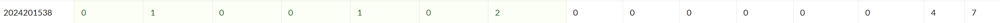

# bomblab 报告

姓名：王梓鉴

学号：2024201538

| 总分 | phase_1 | phase_2 | phase_3 | phase_4 | phase_5 | phase_6 | secret_phase |
| ---- | ------- | ------- | ------- | ------- | ------- | ------- | ------------ |
| 7    | 1       | 1       | 1       | 1       | 1       | 1       | 1            |

scoreboard 截图：



<!-- TODO: 用一个scoreboard的截图，本地图片，放到 imgs 文件夹下，不要用这个 github，pandoc 解析可能有问题 -->

## 解题报告

<!-- 对你拆掉的每个phase进行分析，并写出你得出答案的历程 -->

<!-- 如果能用伪代码还原题目源代码最佳（不属于先前提到的大段代码），语言描述自己的分析也可，每道题目的图片不建议超过两张 -->

### phase_1

```c
The future can't just be made out of sanity.
```

该阶段要求输入一串特定字符串。程序通过调用`string_length`函数，先检查输入和预设字符串长度是否一致，不一致则直接爆炸。之后再按字符比对两串内容，完全一致才算拆弹成功。

通过逆向（查看`lea 0x1d40(%rip),%rsi`等指令）定位目标字符串地址，用IDA分析发现目标串为：  
"The future can't just be made out of sanity."  
输入即可通过。

### phase_2

```c
907478 1067785 957171 1288675
```

 matA (2×3 矩阵)：
```
629  730  369
873  615  578
```

 matB (3×2 矩阵)：
```
384  920
797  531
228  275
```

---

matA × matB


计算公式：
```
C[i][j] = Σ(A[i][k] × B[k][j])
```

详细计算：

**C[0][0]** = 629×384 + 730×797 + 369×228
= 241,536 + 581,810 + 84,132
= 907,478

**C[0][1] **= 629×920 + 730×531 + 369×275
= 578,680 + 387,630 + 101,475
= 1,067,785

**C[1][0] =** 873×384 + 615×797 + 578×228
= 335,232 + 490,155 + 131,784
= 957,171

**C[1][1] =** 873×920 + 615×531 + 578×275
= 803,160 + 326,565 + 158,950
= 1,288,675

### phase_3

```c
0 X 851
```

```asm
(gdb) x/s 0x5555555571e5
0x5555555571e5: "%d %c %d"
(gdb) x/bx 0x55555555a110
0x55555555a110 <mask.1>:        0x20
```
输入格式：%d %c %d（一个数字，一个字符，一个数字）
Mask 值：0x20（十进制 32，ASCII 中是空格）
XOR 运算规则：输入字符 XOR 0x20 = 目标字符
因此：输入字符 = 目标字符 XOR 0x20

### phase_4

提示：Ancient monks moved sacred disks between poles...
考虑汉诺塔的可能

```c
31 AC
```

读入一个数和一个两字符的字符串， 该数字需要等于 func4_1(5) 返回的结果。func4_1() 代码见下：

```c
int func4_1(int n) {
    if (n <= 0) {
        return 0;
    }
    if (n == 1) {
        return 1;
    }
    return 2 * func4_1(n - 1) + 1;
}
```

对于读入的字符串需要满足 func4_2(n, m, L1, L2, L3) 的要求，模拟函数过程如下：

初始为 `func4_2(5, 1, A, B, C)`， `n = 5 != 1` 进入分支，调用 `func4_1(n - 1) >= m`，进入分支，递归调用 `func4_2(4, 1, A, C, B)`、`func4_2(3, 1, A, C, B)`、`func4_2(2, 1, A, C, B)`、`func4_2(1, 1, A, C, B)` 到达 `n == 1` 分支，`%dl、%cl` 寄存器中的值即为目标字符串的值，即 "AC"。

### phase_5

```c
-12 56
```

```asm
(gdb) x/16dw 0x555555557240
0x555555557240 <array.0>:       10      2       14      7
0x555555557250 <array.0+16>:    8       12      15      11
0x555555557260 <array.0+32>:    0       4       1       13
0x555555557270 <array.0+48>:    3       9       6       5
```

```code
index:   0   1   2   3   4   5   6   7   8   9  10  11  12  13  14  15
value:  10   2  14   7   8  12  15  11   0   4   1  13   3   9   6   5
```
目的：
count=8, sum=56
后来搜索发现4 56满足条件，经测试后发现停在explode_bomb断点前，说明结果错误，重新分析代码，发现实际逻辑存在：
```c
if (sscanf 返回值 <= 1) 爆炸
if (第一个数 < 0) 跳过爆炸，继续
否则爆炸
```
因此，第一个数必须为负数，且满足条件，因此输入-12 56。

### phase_6

```c
5 6 4 3 2 1
```


输入六个数字，程序先检查输入的六个数字是否在 1 ~ 6 之间且不重复。然后根据输入的六个数字构造一个链表，链表节点定义如下：

```c
struct ListNode {
    int value;
    int index;
    struct ListNode *next;
};
```

链表节点的结构定义如下：前4个字节存放值（value），随后4个字节存放索引（index），最后8个字节存放指向下一节点的地址（next）。初始状态下，节点依照索引值从小到大顺序连接。程序会根据输入的数字定位相应节点，并将其存储于栈中地址 rsp+88h+var_68 至 rsp+88h+var_40 的区间内。接着，通过 `mov [rbx+8], rax` 指令将这些节点重新链接，形成一个新的链表。最终，程序会校验新链表中各节点的值是否严格按递减顺序排列。

### secret_phase

```c
2626263315311
```

Secret phase的进入条件隐藏在`phase_defused`函数中。当成功解决前6个常规炸弹后，若输入字符串满足特定格式：包含至少6个空格，且第6个空格后的子串为"binary"，则会激活隐藏关卡`secret_phase`。

`secret_phase`会读取一个新输入，并调用关键函数`func7(char *s, size_t a, size_t b, size_t c)`。该函数返回非零值即视为拆弹成功。以下是`func7`的执行逻辑分析：

1. **递归基础条件**  
   若当前坐标满足 `(a, b) == (4, 7)`，函数直接返回1（成功）。

2. **合法性边界检查**  
   - 若递归深度 `c` 超过19或当前字符 `s[c]` 为空（值为0），函数返回0（失败）。

3. **移动规则**  
   取当前字符 `s[c]` 的低3位（`s[c] & 7`）作为索引 `index`。根据索引，从函数内部定义的静态数组中获取四组偏移量：  
   ```
   x1 = array[index],      y1 = array[index+8],
   x2 = array[index+16],   y2 = array[index+24]
   ```
   当前坐标 `(a, b)` 分别加上偏移量 `(x1, y1)` 和 `(x2, y2)` 得到两个新位置。  
   若二维表 `rows`（在源码中实现为链表，此处可视为二维数组）中这两个新位置的值均为1，则路径无效，返回0。

4. **递归探索**  
   若新位置合法，则以 `(a + x1, b + y1)` 为新坐标，深度 `c+1`，递归调用 `func7`。

**问题实质**  
该函数描述了一个在二维网格中从起点 `(0,0)` 移动到终点 `(4,7)` 的寻路问题。每次移动的步长由输入字符串的字符决定，且路径必须始终避开 `rows` 数组中标记为1的“障碍”位置。

**解法**  
可通过深度优先搜索（DFS）求解有效输入。经程序验证，输入序列 `2626263315311` 是一条可行路径。

**代码框架示意**  
```cpp
int offset_array[] = {};// 静态偏移数组 
int rows[7][8] = {};// 二维障碍表 

void dfs(char ch, int a, int b, std::vector<char>& path) {
    if (a == 4 && b == 7) {
        // 找到解：输出路径
        return;
    }
    if (path.size() >= 20) return;

    path.push_back(ch);
    int idx = ch & 7;
    int na = a + offset_array[idx];
    int nb = b + offset_array[idx + 8];
    int check_a = a + offset_array[idx + 16];
    int check_b = b + offset_array[idx + 24];

    // 障碍检查
    if (rows[check_a][check_b] == 1) {
        path.pop_back();
        return;
    }
    // 递归尝试下一步
    for (char next_ch : "01234567") {
        dfs(next_ch, na, nb, path);
    }
    path.pop_back();
}

int main() {
    std::vector<char> path;
    for (char ch : "01234567") {
        dfs(ch, 0, 0, path);
    }
}
```

## 反馈/收获/感悟/总结

<!-- 这一节，你可以简单描述你在这个 lab 上花费的时间/你认为的难度/你认为不合理的地方/你认为有趣的地方 -->

<!-- 或者是收获/感悟/总结 -->

<!-- 200 字以内，可以不写 -->

花费时间：约9小时

难度适中，secret_phaseyo有一定挑战性，phase5的-12也花费了较长时间才发现，使用了 IDA 的辅助，在跳转逻辑和静态变量分析上节省了不少时间

有一说一硬看汇编代码太痛苦了，还是转化成c代码更容易理解

## 参考的重要资料

<!-- 有哪些文章/论文/PPT/课本对你的实现有重要启发或者帮助，或者是你直接引用了某个方法 -->

<!-- 请附上文章标题和可访问的网页路径 -->

无
